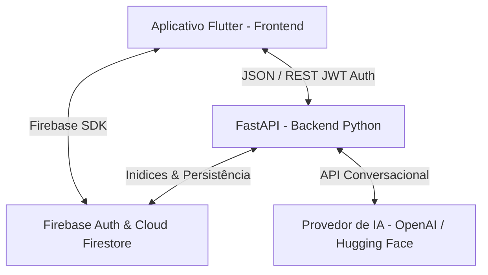

# Documentação do Projeto: Gaia - Apoio Psicológico Inteligente (TCC)

Esta documentação detalha a arquitetura, as diretrizes de design de UI/UX, o modelo de inteligência conversacional e o fluxo do ecossistema do aplicativo **Gaia**, desenvolvido como um assistente de apoio emocional complementar baseado em conceitos de Terapia Cognitivo-Comportamental (TCC) e Mindfulness.

---

## 1. Visão Geral do Sistema
O ecossistema da **Gaia** é dividido em duas frentes integradas, operando sob restrições severas de e-health e ética clínica acadêmica:



### Principais Frentes do Projeto:
1. **Frontend (Flutter)**: Aplicação responsiva multiplataforma (Android, iOS, Web, Windows, macOS) focada em acessibilidade, acolhimento visual e controle de estado dinâmico com Riverpod.
2. **Backend (FastAPI)**: API assíncrona responsável por classificar intenções, detectar risco emocional agudo, gerenciar conversas híbridas e integrar provedores de IA de forma transparente.
3. **Banco de Dados e Segurança (Firebase)**: Cloud Firestore para armazenamento criptografado de históricos de conversas, registros de humor e diários emocionais, com autenticação via Firebase Auth.

---

## 2. Arquitetura do Backend (FastAPI)
O backend foi construído em Python, adotando processamento assíncrono de alto desempenho (`async/await`) e design baseado em serviços desacoplados:

### A. Serviços de IA e Provedores (`AIProvider`)
O `AIProvider` unifica a chamada de LLMs externas, agindo de forma adaptativa. De acordo com as chaves configuradas nas variáveis de ambiente (`.env`), ele pode rotear o processamento para:
- **OpenAI**: Utilizando o modelo `gpt-3.5-turbo` ou `gpt-4`.
- **Hugging Face**: Via chamadas de inferência de modelos open-source (ex.: Llama, Mistral).
- **Fallback Local**: Caso todos os provedores externos falhem, o sistema utiliza uma máquina de estados baseada em regex empática para evitar que o usuário fique sem resposta.

### B. Classificador de Intenções Semântico (`IntentionClassifier`)
Toda mensagem do usuário passa por um fluxo de roteamento de duas camadas:
1. **Regras Determinísticas**: Busca de palavras-chave críticas (como "respirar" ou "cvv") para respostas instantâneas.
2. **LLM Zero-Shot**: Se não houver correspondência, o `AIProvider` é consultado para classificar semanticamente o texto do usuário em uma das seguintes intenções:
   - `conversa_emocional`: Desabafo ou bate-papo aberto.
   - `exercicio`: Intenção de realizar práticas de TCC (Questionamento Socrático).
   - `mindfulness`: Desejo de relaxar ou iniciar respiração guiada.
   - `psicoeducacao`: Dúvidas teóricas sobre saúde mental (ansiedade, sono, estresse, regulação emocional).
   - `diario_emocional`: Intenção de escrever um diário.
   - `checkin`: Registro de humor.
   - `crise`: Sofrimento extremo ou ideação suicida.

### C. Detector de Risco Campo de Força (`RiskDetector`)
Para garantir a segurança clínica, o texto é submetido a uma triagem de risco de 5 níveis (0 a 4):
- **Níveis 0 a 2 (Bem-estar / Sofrimento Leve a Moderado)**: Fluxo conversacional normal.
- **Nível 3 (Alto Risco)**: Ideação passiva ou sofrimento agudo. A IA sugere contato imediato com a rede de apoio ou o CVV.
- **Nível 4 (Crise Aguda)**: Risco de auto-extermínio imediato. A resposta da IA é substituída por um aviso de segurança failsafe e o aplicativo é instruído a disparar o discador telefônico do celular.

### D. Memória de Curto Prazo (Histórico de Conversas)
O histórico de mensagens de cada sessão é recuperado de forma cronológica do Firestore. Visando evitar sobrecarga e a necessidade de gerar índices compostos complexos no banco, o backend busca todas as mensagens da sessão em ordem crescente e fatia as **10 mensagens mais recentes em memória** (`[-10:]`). As últimas 6 mensagens são enviadas à LLM para garantir que o assistente tenha contexto imediato, respondendo com naturalidade.

---

## 3. Fluxos Clínicos e Exercícios Empáticos
O diálogo com a Gaia foi blindado no [ConversationalManager](file:///c:/Users/Lenovo/OneDrive/Documentos/tcc-proj/backend/app/services/conversational.py) e [openai_service.py](file:///c:/Users/Lenovo/OneDrive/Documentos/tcc-proj/backend/app/services/openai_service.py) para seguir estritamente o tom terapêutico:

### A. Escuta Ativa e Espelhamento Rogeriano
O `System Prompt` de Gaia exige que ela valide os afetos do usuário e espelhe sutilmente as expressões físicas descritas (ex: se o usuário diz *"sinto meu peito apertado"*, Gaia inicia respondendo *"compreendo o quanto essa sensação de aperto no peito é desconfortável e assustadora..."*).

### B. Brevidade e Fadiga Cognitiva
As respostas conversacionais de Gaia são limitadas pelo prompt a no máximo **3 ou 4 linhas**. Isso reduz a fadiga de leitura e cognitiva comum em usuários que estão sob altos níveis de estresse ou ansiedade.

### C. Oferta Orgânica e Ativação Fluida de Exercícios
Em vez de forçar menus estáticos ou botões engessados, Gaia oferece os exercícios de forma contextualizada:
1. **Oferta**: Se o usuário relata sintomas de ansiedade física no desabafo, Gaia sugere: *"Você gostaria de fazer um exercício rápido de respiração ou ancoragem comigo agora para ajudar a se acalmar?"*
2. **Monitoramento**: O backend detecta que a oferta foi feita e atualiza o estado para `session_state["offered_exercise"] = "grounding_54321"`.
3. **Ativação**: Se o usuário aceitar de forma coloquial na próxima linha (*"sim"*, *"quero"*, *"vamos"*, *"pode ser"*), o sistema intercepta, altera o estado da sessão e inicia o exercício estruturado (**Ancoragem 5-4-3-2-1** ou **Questionamento Socrático**) instantaneamente.

---

## 4. Design Visual e Usabilidade (UI/UX no Flutter)
O visual do aplicativo foi reformulado com o objetivo de reduzir o contraste agressivo, transmitindo paz e estabilidade através do tema terapêutico **Slate & Teal**:

### A. Nova Paleta de Cores
- **Tema Escuro (Principal)**:
  - Background Principal: `#0F172A` (Slate Escuro - reduz a fadiga visual).
  - Cards e Inputs (Surface): `#1E293B` (Slate Médio).
  - Cor Primária (Botões e destaques): `#0D9488` (Teal Calmo).
  - Cor Secundária (Links e ícones): `#38BDF8` (Sky Blue).
  - Texto Principal: `#F8FAFC` (Off-white para evitar o brilho agressivo do branco puro).
- **Tema Claro (Complementar)**:
  - Background: `#F8FAFC` (Off-white suave).
  - Cards e Inputs (Surface): `#FFFFFF` (Branco puro).

### B. Elementos da Interface de Chat
- **Bolhas Assecionadas**: Bolhas de conversação com cantos arredondados (`20dp`), sombras tridimensionais suaves e avatares dinâmicos para evitar colamento com as bordas da tela.
- **Identidade e Avatares**:
  - Removido o ícone genérico de engrenagem na cabeça. Agora, a tela inicial exibe um rosto sorridente empático (`Icons.sentiment_satisfied_alt_rounded`).
  - Cada bolha de mensagem no histórico exibe a foto do perfil de quem enviou (foto da conta do Google/Firebase para o usuário, e o ícone de Gaia para a IA), incluindo também a exibição do horário formatado em `HH:mm`.
- **Barra de Sugestões Estilo Gemini**: Posicionada logo acima do campo de texto, exibe pílulas de atalho com scroll horizontal e um efeito suave de fade-out nas bordas (`ShaderMask`) para continuidade estética. Ela se oculta dinamicamente após a primeira mensagem.
- **Botão de Enviar Inteligente**: Centralizado verticalmente à direita do campo de texto com ícone de seta para cima, que se transforma em botão de parada (stop) de cor vermelha durante o carregamento de pensamentos da IA.

---

## 5. Como Executar o Projeto

### Pré-requisitos
- Flutter SDK instalado e configurado na PATH.
- Python 3.10+ instalado.
- Banco de dados Firebase ativo (Firestore e Authentication).

### Executando o Backend (FastAPI)
1. Navegue até a pasta `backend`.
2. Configure as chaves no arquivo `.env` (exemplo em `.env.example`).
3. Instale as dependências:
   ```bash
   pip install -r requirements.txt
   ```
4. Inicie o servidor localmente:
   ```bash
   uvicorn app.main:app --reload --host 0.0.0.0 --port 8000
   ```
5. Rode os testes unitários do backend para validação:
   ```bash
   python -m pytest
   ```

### Executando o Frontend (Flutter)
1. Navegue até a pasta `frontend`.
2. Baixe os pacotes:
   ```bash
   flutter pub get
   ```
3. Execute o analisador para garantir integridade do código:
   ```bash
   flutter analyze
   ```
4. Rode a aplicação em modo de desenvolvimento (ou compile para a plataforma desejada):
   ```bash
   flutter run
   ```
