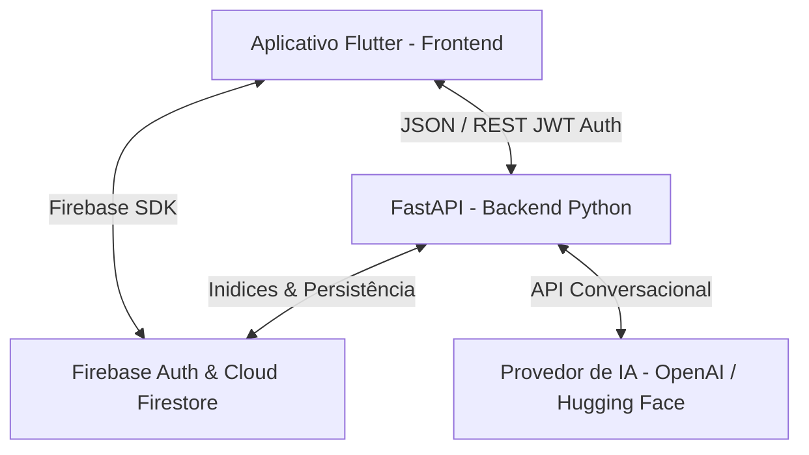

# Documentação do Projeto: Gaia - Apoio Psicológico Inteligente (TCC)

Esta documentação detalha a arquitetura, as diretrizes de design de UI/UX, o modelo de inteligência conversacional e o fluxo do ecossistema do aplicativo **Gaia**, desenvolvido como um assistente de apoio emocional complementar baseado em conceitos de Terapia Cognitivo-Comportamental (TCC) e Mindfulness.

---

## 1. Visão Geral do Sistema

O ecossistema da **Gaia** é dividido em duas frentes integradas, operando sob restrições severas de e-health e ética clínica acadêmica:



### Principais Frentes do Projeto:
1. **Frontend (Flutter)**: Aplicação responsiva multiplataforma (Android, iOS, Web, Windows, macOS) focada em acessibilidade, acolhimento visual e controle de estado dinâmico com Riverpod.
2. **Backend (FastAPI)**: API assíncrona responsável por classificar intenções, detectar risco emocional agudo, gerenciar conversas híbridas e integrar provedores de IA de forma transparente.
3. **Banco de Dados e Segurança (Firebase)**: Cloud Firestore para armazenamento criptografado de históricos de conversas, registros de humor e diários emocionais, com autenticação via Firebase Auth.

---

## 2. Arquitetura do Backend (FastAPI)

O backend foi construído em Python, adotando processamento assíncrono de alto desempenho (`async/await`) e design baseado em serviços desacoplados:

### A. Serviços de IA e Provedores (`AIProvider`)
O `AIProvider` unifica a chamada de LLMs externas, agindo de forma adaptativa e altamente resiliente através de um mecanismo de **Fallback Multi-Provedor**:
- **OpenAI (Provedor Primário)**: O sistema tenta prioritariamente consumir a API da OpenAI (utilizando o modelo `gpt-3.5-turbo` ou `gpt-4`).
- **Hugging Face (Fallback de Resiliência)**: Se a OpenAI falhar devido a Timeout, erros de servidor (5xx) ou cota estourada, a exceção é capturada de forma limpa e o backend imediatamente faz o fallback para o Hugging Face (via chamadas de inferência de modelos open-source como Llama ou Mistral) como alternativa, garantindo que o usuário não fique sem resposta.
- **Fallback Local**: Caso ambos os provedores externos falhem, o sistema utiliza uma máquina de estados baseada em regex empática para evitar que o usuário fique sem resposta.

### B. Classificador de Intenções Semântico (`IntentionClassifier`)
Toda mensagem do usuário passa por um fluxo de roteamento de duas camadas:
1. **Regras Determinísticas**: Busca de palavras-chave críticas (como "respirar" ou "cvv") para respostas instantâneas.
2. **LLM Zero-Shot**: Se não houver correspondência, o `AIProvider` é consultado para classificar semanticamente o texto do usuário em uma das seguintes intenções:
   - `conversa_emocional`: Desabafo ou bate-papo aberto.
   - `exercicio`: Intenção de realizar práticas de TCC (Questionamento Socrático).
   - `mindfulness`: Desejo de relaxar ou iniciar respiração guiada.
   - `psicoeducacao`: Dúvidas teóricas sobre saúde mental (ansiedade, sono, estresse, regulação emocional).
   - `diario_emocional`: Intenção de escrever um diário.
   - `checkin`: Registro de humor.
   - `crise`: Sofrimento extremo ou ideação suicida.

### C. Detector de Risco Campo de Força (`RiskDetector` e Guardrail de Entrada)
Para garantir a segurança clínica absoluta do usuário, toda mensagem recebida no endpoint `/message` passa por uma triagem integrada em 3 camadas que classifica o nível de risco de 0 a 4. O tratamento de risco foi estruturado na camada de **Guardrail de Entrada** no endpoint de mensagem do chat (FastAPI):
- **Nível 4 (Crise Aguda / Ideação Crítica / Automutilação)**: Interceptação imediata no endpoint. A requisição é interrompida no início do pipeline do FastAPI e nenhuma mensagem é enviada para as APIs de LLM. Retorna-se imediatamente uma resposta estática pré-definida de segurança de crise (Protocolo de crise com suporte/CVV 188 e SAMU 192) contendo as flags e metadados apropriados no JSON de saída (`risk_level: 4`, `action: show_emergency_screen`, `emergency_numbers`). A conversa é salva no banco de dados para integridade de histórico e o fluxo é retornado.
- **Níveis 1 a 3 (Risco normal / Sofrimento Leve a Alto)**: O fluxo prossegue para o processamento de IA. O risco é repassado ao `ConversationalManager` para evitar retrabalho de detecção. Em mensagens classificadas como Nível 3, o backend garante a injeção do número do CVV (`188`) no campo de suporte do payload de saída, permitindo que o frontend exiba os pop-ups ou opções de acolhimento necessárias.
- **Nível 0 (Bem-estar / Sem sofrimento)**: Fluxo de conversação geral ou atalhos normais.

### D. Memória de Curto Prazo (Histórico de Conversas)
O histórico de mensagens de cada sessão é recuperado de forma cronológica do Firestore. Visando evitar sobrecarga e a necessidade de gerar índices compostos complexos no banco, o backend busca todas as mensagens da sessão em ordem crescente e fatia as **10 mensagens mais recentes em memória** (`[-10:]`). As últimas 6 mensagens são enviadas à LLM para garantir que o assistente tenha contexto imediato, respondendo com naturalidade.

---

## 3. Fluxos Clínicos e Exercícios Empáticos

O diálogo com a Gaia foi blindado no `ConversationalManager` e `openai_service.py` para seguir estritamente o tom terapêutico:

### A. Escuta Ativa e Espelhamento Rogeriano
O `System Prompt` de Gaia exige que ela valide os afetos do usuário e espelhe sutilmente as expressões físicas descritas (ex: se o usuário diz *"sinto meu peito apertado"*, Gaia inicia respondendo *"compreendo o quanto essa sensação de aperto no peito é desconfortável e assustadora..."*).

### B. Brevidade e Fadiga Cognitiva
As respostas conversacionais de Gaia são limitadas pelo prompt a no máximo **3 ou 4 linhas**. Isso reduz a fadiga de leitura e cognitiva comum em usuários que estão sob altos níveis de estresse ou ansiedade.

### C. Oferta Orgânica e Ativação Fluida de Exercícios
Em vez de forçar menus estáticos ou botões engessados, Gaia oferece os exercícios de forma contextualizada:
1. **Oferta**: Se o usuário relata sintomas de ansiedade física no desabafo, Gaia sugere: *"Você gostaria de fazer um exercício rápido de respiração ou ancoragem comigo agora para ajudar a se acalmar?"*
2. **Monitoramento**: O backend detecta que a oferta foi feita e atualiza o estado para `session_state["offered_exercise"] = "grounding_54321"`.
3. **Ativação**: Se o usuário aceitar de forma coloquial na próxima linha (*"sim"*, *"quero"*, *"vamos"*, *"pode ser"*), o sistema intercepta, altera o estado da sessão e inicia o exercício estruturado (**Ancoragem 5-4-3-2-1** ou **Questionamento Socrático**) instantaneamente.

---

## 4. Design Visual e Usabilidade (UI/UX no Flutter)

O visual do aplicativo foi reformulado com o objetivo de reduzir o contraste agressivo, transmitindo paz e estabilidade através do tema terapêutico **Slate & Teal**:

### A. Nova Paleta de Cores
- **Tema Escuro (Principal)**:
  - Background Principal: `#0F172A` (Slate Escuro - reduz a fadiga visual).
  - Cards e Inputs (Surface): `#1E293B` (Slate Médio).
  - Cor Primária (Botões e destaques): `#0D9488` (Teal Calmo).
  - Cor Secundária (Links e ícones): `#38BDF8` (Sky Blue).
  - Texto Principal: `#F8FAFC` (Off-white para evitar o brilho agressivo do branco puro).
- **Tema Claro (Complementar)**:
  - Background: `#F8FAFC` (Off-white suave).
  - Cards e Inputs (Surface): `#FFFFFF` (Branco puro).

### B. Elementos da Interface de Chat
- **Bolhas Arredondadas**: Bolhas de conversação com cantos arredondados (`20dp`), sombras tridimensionais suaves e avatares dinâmicos para evitar colamento com as bordas da tela.
- **Identidade e Avatares**:
  - Removido o ícone genérico de engrenagem na cabeça. A tela inicial exibe um rosto sorridente empático (`Icons.sentiment_satisfied_alt_rounded`).
  - Cada bolha de mensagem no histórico exibe a foto de perfil (foto da conta do Google/Firebase para o usuário, e a Gaia sorridente para a IA), incluindo a exibição do horário formatado em `HH:mm`.
- **Barra de Sugestões Estilo Gemini**: Posicionada logo acima do campo de texto, exibe pílulas de atalho com scroll horizontal e um efeito suave de fade-out nas bordas (`ShaderMask`) para continuidade estética. Ela se oculta dinamicamente após a primeira mensagem.
- **Botão de Enviar Inteligente**: Centralizado verticalmente à direita do campo de texto com ícone de seta para cima, que se transforma em botão de parada (stop) de cor vermelha durante o carregamento de pensamentos da IA.

---

## 5. Detalhamento de Códigos Importantes

### A. Código do Frontend: `BreathingExerciseCard` (Flutter/Dart)
Este componente ([breathing_exercise_card.dart](file:///c:/Users/Lenovo/OneDrive/Documentos/tcc-proj/frontend/lib/core/widgets/breathing_exercise_card.dart)) gerencia o estado local e as animações do exercício de respiração guiado. Ele implementa um cronômetro cíclico assíncrono que divide o exercício em 3 etapas com durações ajustadas para promover a calma: **Inalar** (fixo em 4 segundos), **Segurar** (pausa variável de 2 a 7 segundos por ciclo) e **Exalar** (expiração variável de 6 a 7 segundos por ciclo). O exercício é executado por um número variável de **4 a 8 repetições** (definido aleatoriamente a cada início de sessão para evitar monotonia), exibindo uma tela final de conclusão ao término dos ciclos.

```dart
class _BreathingExerciseCardState extends State<BreathingExerciseCard> {
  Timer? _timer;
  String _phase = 'Inalar'; // 'Inalar', 'Segurar', 'Exalar'
  int _secondsCounter = 1;
  bool _showNumber = false;
  int _cycleCount = 1;

  final _random = Random();
  late int _targetCycles;
  late int _pauseDuration;
  late int _expirationDuration;
  int _currentTick = 0;
  bool _completed = false;

  @override
  void initState() {
    super.initState();
    _targetCycles = 4 + _random.nextInt(5); // 4 a 8 vezes
    _randomizeDurations();
    _startExercise();
  }

  void _randomizeDurations() {
    _pauseDuration = 2 + _random.nextInt(6); // 2-7 segundos
    _expirationDuration = 6 + _random.nextInt(2); // 6-7 segundos
  }

  void _startExercise() {
    _timer = Timer.periodic(const Duration(milliseconds: 500), (timer) {
      if (!mounted) return;
      setState(() {
        _currentTick++;
        _showNumber = _currentTick % 2 != 0;
        _secondsCounter = ((_currentTick - 1) ~/ 2) + 1;

        int currentPhaseDuration = 4;
        if (_phase == 'Segurar') {
          currentPhaseDuration = _pauseDuration;
        } else if (_phase == 'Exalar') {
          currentPhaseDuration = _expirationDuration;
        }

        if (_currentTick >= currentPhaseDuration * 2) {
          _currentTick = 0;
          _secondsCounter = 1;
          _showNumber = false;

          if (_phase == 'Inalar') {
            _phase = 'Segurar';
          } else if (_phase == 'Segurar') {
            _phase = 'Exalar';
          } else {
            _phase = 'Inalar';
            _cycleCount++;
            if (_cycleCount > _targetCycles) {
              _completed = true;
              _timer?.cancel();
            } else {
              _randomizeDurations();
            }
          }
        }
      });
    });
  }

  @override
  void dispose() {
    _timer?.cancel();
    super.dispose();
  }

  double _getScale() {
    if (_completed) return 1.0;
    if (_phase == 'Inalar') {
      double progress = _currentTick / 8.0;
      if (progress > 1.0) progress = 1.0;
      return 1.0 + progress * 0.4;
    } else if (_phase == 'Segurar') {
      return 1.4;
    } else {
      double progress = _currentTick / (_expirationDuration * 2.0);
      if (progress > 1.0) progress = 1.0;
      return 1.4 - progress * 0.4;
    }
  }
}
```

#### Aspectos Relevantes:
1. **Controle de Pulsação Fluido com Durações Dinâmicas**: O método `_getScale()` calcula a escala proporcionalmente ao progresso real do tempo decorrido de cada fase (`_currentTick` em relação ao total de ticks da fase). Isso garante que o movimento de inflar (até 1.4) e desinflar (até 1.0) seja suave e proporcional, mesmo com durações variáveis (pausa de 2 a 7s e expiração de 6 a 7s).
2. **Ciclos e Tempos Dinâmicos**: A randomização do total de repetições (4 a 8 vezes por sessão) e das durações internas (pausa de 2-7s, expiração de 6-7s) evita que o exercício fique monótono para o usuário, promovendo o engajamento de longo prazo.
3. **Tela de Conclusão Dedicada**: Ao fim das repetições programadas, a animação é encerrada e uma interface de sucesso é exibida ao usuário, oferecendo feedback positivo de conclusão e um botão explícito para fechar o card.
4. **Oscilação de Alta Frequência (500ms)**: Mantém-se o piscar alternado a cada 500ms entre o avatar da Gaia e o número do contador, proporcionando dinamismo visual sem comprometer a performance.

---

### B. Código do Backend: `_generate_local_fallback` (FastAPI/Python)
Este método ([ai_provider.py](file:///c:/Users/Lenovo/OneDrive/Documentos/tcc-proj/backend/app/services/ai_provider.py)) atua como uma barreira robusta de fail-safe no backend. Caso ocorra perda de conectividade com as APIs da OpenAI ou HuggingFace, o sistema evita o silêncio clínico interpretando palavras-chave do usuário e injetando diretrizes contextuais de escuta terapêutica e atalhos na resposta.

```python
    def _generate_local_fallback(self, user_message: str) -> str:
        import re
        msg_lower = user_message.lower()
        
        # 1. Detecção de fora de escopo (Recusa inteligente de perguntas gerais)
        out_of_scope_keywords = ["ferrari", "mustang", "carro", "futebol", "política", "politica", "melhor carro", "melhor que", "quem é melhor", "quem e melhor", "preço de", "preco de", "compara", "vs"]
        if any(keyword in msg_lower for keyword in out_of_scope_keywords):
            return (
                "Como Gaia, sua assistente virtual de apoio emocional, meu foco é oferecer escuta ativa, validação e acolhimento nos momentos difíceis. "
                "Por isso, assuntos como esse estão fora do meu escopo e função como ferramenta de apoio. Como você está se sentindo emocionalmente agora?"
            )

        # 2. Triagem severa de risco e ideação
        suicide_terms = ["matar", "suicid", "tirar minha vida", "fim na minha vida", "enforcar", "fim a tudo", "morrer"]
        if any(term in msg_lower for term in suicide_terms):
            return (
                "Percebo que você está passando por uma dor imensa e difícil de suportar, mas quero que saiba que sua vida tem muito valor "
                "e você não está sozinho. Por favor, converse com alguém próximo ou ligue gratuitamente para o Centro de Valorização "
                "da Vida (CVV) pelo número 188. Eles oferecem apoio emocional confidencial 24 horas por dia."
            )

        # 3. Interceptação de Ansiedade e Gatilho do Exercício de Respiração
        if "ansia" in msg_lower or "ansioso" in msg_lower or "ansiosa" in msg_lower or "panic" in msg_lower or "pânico" in msg_lower or "peito apertado" in msg_lower or "respirar" in msg_lower or "respiração" in msg_lower:
            return (
                "Entendo perfeitamente o quanto a ansiedade e a sensação física de aperto podem ser desconfortáveis. "
                "Gostaria de realizar uma prática rápida de respiração consciente comigo agora para ajudar a se acalmar? "
                "Basta iniciar no botão abaixo: action:breathing_exercise"
            )
            
        # 4. Interceptação de Lembretes / Medicamentos / Consultas
        elif any(k in msg_lower for k in ["remedio", "remédio", "medicamento", "consulta", "médico", "medico", "psiquiatra", "lembrar", "tomar", "lembrete"]):
            return (
                "Lidar com nossa saúde requer atenção e rotina. Percebi que mencionou algo que pode precisar de um lembrete. "
                "Para te apoiar, você pode agendar um lembrete direto aqui no aplicativo para receber alertas locais. "
                "Clique para cadastrar: action:create_reminder"
            )

        # 5. Outros estados emocionais e Fallback Rogeriano geral...
        # (retorna resposta empática se não cair em nenhuma regra estruturada)
```

#### Aspectos Relevantes:
1. **Recusa Pró-ativa de Assuntos Gerais**: Impede que a IA saia do papel terapêutico ao barrar consultas aleatórias (comparação de carros, esportes, etc.) de forma determinística na camada de fallback local e de prompt de sistema.
2. **Injeção de Metadados de Ação**: O backend sinaliza para o frontend a necessidade de renderizar atalhos interativos ao retornar strings estruturadas como `action:breathing_exercise` ou `action:create_reminder` dentro do fluxo textual comum. Isso desacopla a regra de negócio do backend e mantém o protocolo de comunicação limpo via REST/JSON.

---

## 6. Como Executar o Projeto

### Pré-requisitos
- Flutter SDK instalado e configurado na PATH.
- Python 3.10+ instalado.
- Banco de dados Firebase ativo (Firestore e Authentication).

### Executando o Backend (FastAPI)
1. Navegue até a pasta `backend`.
2. Configure as chaves no arquivo `.env` (exemplo em `.env.example`).
3. Instale as dependências:
   ```bash
   pip install -r requirements.txt
   ```
4. Inicie o servidor localmente:
   ```bash
   uvicorn app.main:app --reload --host 0.0.0.0 --port 8000
   ```
5. Rode os testes unitários do backend para validação:
   ```bash
   python -m pytest
   ```

### Executando o Frontend (Flutter)
1. Navegue até a pasta `frontend`.
2. Baixe os pacotes:
   ```bash
   flutter pub get
   ```
3. Execute o analisador para garantir integridade do código:
   ```bash
   flutter analyze
   ```
4. Rode a aplicação em modo de desenvolvimento (ou compile para a plataforma desejada):
   ```bash
   flutter run
   ```
